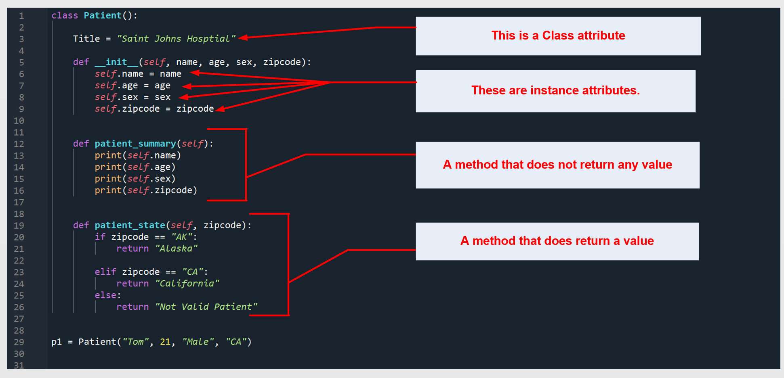
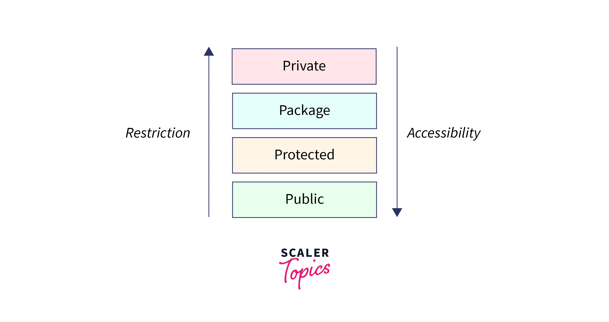

# OOP

## Introduction Object-Oriented Programming (OOP)
**Object**

- An object is like a self-contained unit in the program.
- It stores information about (state) and can perform certain behaviors.

**Attribute**

- The state of an object refers to the information it hold.
- Attributes are the variables that hold data of an object.

**Behavior**

- Behavior defines the actions that an object can perform.

**4 key properties of OOP**

OOP is structured around four fundamental principles that enhance code organization and flexibility:

<ul style="padding-left: 20px;">
  <li>Encapsulation (Đóng gói)</li>
  <li>Abstraction (Trừu tượng)</li>
  <li>Inheritance (Kế thừa)</li>
  <li>Polymorphism (Đa hình)</li>
</ul>

## Class and Object 
**Class**

A class is a blueprint for creating objects. It defines a set of attributes and methods that the created objects will have. Think of a class as a template that outlines the structure and behavior of the objects.

**Object**

An object is an instance of a class. It is a concrete entity based on the class template, holding specific values for the attributes defined by the class.


## Attributes and Methods in OOP

**Attributes**

Attributes are the characteristics or properties associated with a class or an object. They represent the state or data that objects of a certain class can hold. In Python, attributes are defined within a class and are accessed using the dot notation ```object.attribute```

**Methods**

Methods are functions defined within a class. They define the behavior of the class's objects. Methods can manipulate the object's state (attributes) and perform operations relevant to the class.



## Introduction to Encapsulation (Đóng gói)

Access modifiers are keywords in object-oriented programming languages that control the accessibility of classes, methods, and variables. They determine whether a particular class member can be accessed from outside the class and, if so, to what extent. Different programming languages may have different access modifiers, but they typically include public, protected, private, and sometimes default (package-private or internal).



**1.Public**

- Description: In Python, members are public by default, meaning they can be accessed from anywhere within and outside the class.

**2.Protected**

- Description: Conventionally, members intended to be protected is prefixed with a single underscore (```_```). This indicates to other developers that these members should be protected and not accessed directly from outside the class. However, Python does not enforce this restriction.

**3.Private**

- Description: Members intended to be private are prefixed with a double underscore (```__```). This invokes name mangling, which internally modifies the member's name to include the class name, making it harder to access from outside the class. However, it's important to note that Python doesn't strictly enforce data hiding, and accessing private members is still possible.


