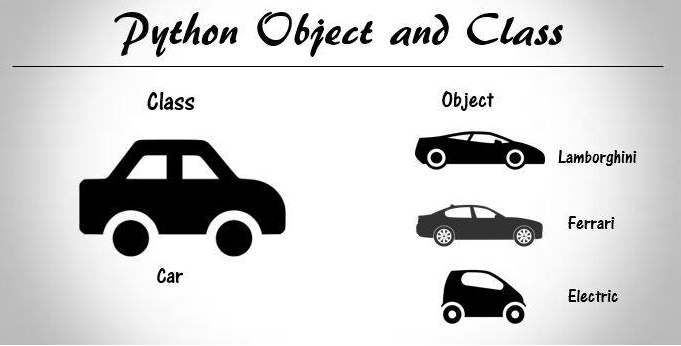

# OOP

## Introduction Object-Oriented Programming (OOP)
**Object**

- An object is like a self-contained unit in the program.
- It stores information about (state) and can perform certain behaviors.

**Attribute**

- The state of an object refers to the information it hold.
- Attributes are the variables that hold data of an object.

**Behavior**

- Behavior defines the actions that an object can perform.

**4 key properties of OOP**

OOP is structured around four fundamental principles that enhance code organization and flexibility:

<ul style="padding-left: 20px;">
  <li>Encapsulation (Đóng gói)</li>
  <li>Abstraction (Trừu tượng)</li>
  <li>Inheritance (Kế thừa)</li>
  <li>Polymorphism (Đa hình)</li>
</ul>

## Class and Object 
*Class*

A class is a blueprint for creating objects. It defines a set of attributes and methods that the created objects will have. Think of a class as a template that outlines the structure and behavior of the objects.

*Object*

An object is an instance of a class. It is a concrete entity based on the class template, holding specific values for the attributes defined by the class.

Here is example: 

